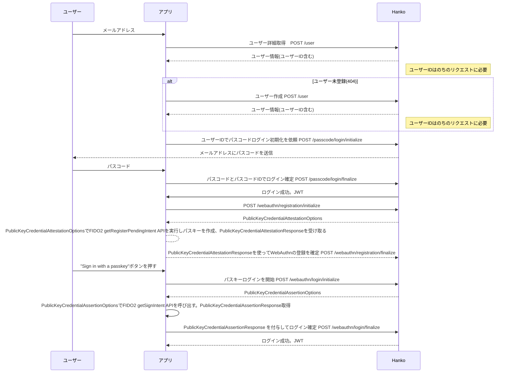

本記事は「株式会社RetailAI X Advent Calendar 2022」の17日目の記事です。
昨日は@takudooonさんの「[ESP32を通してUSBデバイスへの理解をちょっと深めた話](https://zenn.dev/takudooon/articles/79345e925bba01)」でした。

---

パスワードレスな認証を実現する認証ミドルウェア Hankoを、モバイルアプリから利用する手順とサンプルコードが公式から提供されたので、勉強のために動かしてみます。

https://docs.hanko.io/guides/mobile_guide





# 試してみる

Hanko CloudでHankoプロジェクトを作成（セルフホストもできます）

https://cloud.hanko.io


アプリのソースコードをクローン

```
git clone https://github.com/teamhanko/hanko-android-example.git
```

`app/src/main/res/values/strings.xml`ファイルで指定されている`assetlinks.json`のドメインを変更します。

```
        [{
            \"include\": \"https://your-domain.com/.well-known/assetlinks.json\"
        }]
```


`app/src/main/java/io/hanko/hanko_mobile_example/KtorClient.kt`の`BASE_URL`変数の値を作成したHankoバックエンドのURLに変更し、アプリを起動します

```kotlin
object ApiRoutes {
    private const val BASE_URL = "<YOUR_HANKO_API>"
```

> まだ手元のデバイスでパスキーログインが動かせていないので、動かせ次第、スクリーンショット添付します


# 感想


パスワードレスの認証を導入できれば、店舗オペレーションの負担軽減ができる可能性があります。

今回、勉強のためにHankoを利用してみたのですが、理解不足で動かせるところまで行きませんでした。引き続き調べて、更新したいと思います。


ゆくゆくは、FlutterアプリでもPassKeyログインを試してみたいです。

# 参考

https://docs.hanko.io/guides/mobile_guide

https://codelabs.developers.google.com/codelabs/fido2-for-android#0

https://github.com/mojaloop/contrib-fido2-flutter-lib


# 次は…

明日は、@yoshitake_tatsuhiroさんの記事になります！